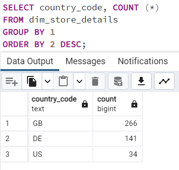

# SQL Data Analysis Queries

### Q1: Operational Footprint 
- **Objective:** Identify operational countries and the one with the most stores.
PYTH

### Q2: Store Locations Analysis 
- **Objective:** Find locations with the most stores for strategic decisions.

### Q3: Sales Trend Analysis 
- **Objective:** Analyze which months have the highest sales.

### Q4: Online vs Offline Sales 
- **Objective:** Calculate product sales and amounts for online and offline purchases.

### Q5: Store Type Revenue Analysis 
- **Objective:** Assess total and percentage of sales from different store types.

### Q6: Historical Sales Analysis 
- **Objective:** Determine which months in which years have had the most sales historically.

### Q7: Staff Numbers per Location 
- **Objective:** Identify staff numbers in each operational country.

### Q8: Sales Analysis in Germany
- **Objective:** Identify which store type is generating the most sales in Germany.

### Q9: Sales Velocity Analysis
- **Objective:** Evaluate average time between each sale, grouped by year.
